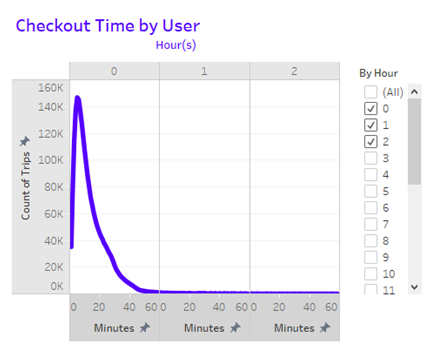
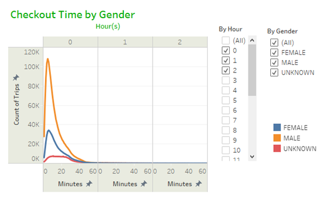
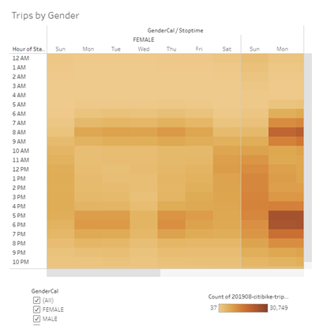
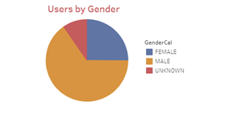
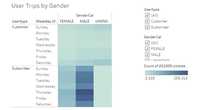
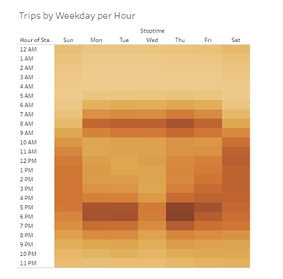
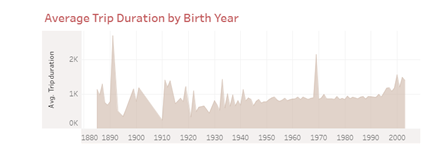

# Module_14_NYC_Citibike
UNC Bootcamp - Module 14 Challenge

## OVERVIEW
This analysis was done to investigate whether a bike-sharing program would a feasible business proposal for Des Moines, Iowa. The data that was reviewed came from the Citi Bike Program in New York City. The data was downloaded from their historical files and is for August 2019 only. The data was loaded, and a new field was added using Python and Pandas. The new field, TripDurationDT, changes the duration from an Integer to a DateTime field to make it easier to calculate times.

&nbsp;&nbsp;&nbsp;&nbsp;&nbsp;   

Checkout Time by User: This graph uses the count of trips and trip duration to visualize the most common trip lengths. Most trips were under thirty minutes. There is a potential for invalid data for any trip under five minutes in length. These should be verified as actual customer trips. They could be canceled trips due to bike problems or test trips by staff. 

&nbsp;&nbsp;&nbsp;&nbsp;&nbsp;   

Checkout Time by Gender:  The trip durations were also reviewed based on gender, which indicated that most trips were taken by males. 

&nbsp;&nbsp;&nbsp;&nbsp;&nbsp;   

Trips by Weekday per Hour:  This heatmap indicates that most trips were taken during the 7:00-9:00 morning hours and the 4:00-7:00 evening hours during the weekdays, with a fairly even spread on the weekend days.

&nbsp;&nbsp;&nbsp;&nbsp;&nbsp;   

Trips By Gender:  Here we can see that the most common start times in the previous graph were true for both male and females.

&nbsp;&nbsp;&nbsp;&nbsp;&nbsp;   

User Trips by Gender:  Citi Bike provides several plans for bike usage, including Subscriber (monthly or yearly plan) or a Customer (day or trip plan). This visualization shows the trips by the user type per weekday and gender. Thursday shows as a favorite day for Subscribers, while Saturday was more populate for the Customers.

&nbsp;&nbsp;&nbsp;&nbsp;&nbsp;   

Users by Gender:  This confirms that most of the users are male. The numbers could indicate a marketing opportunity and needs to be further researched to determine why there are not more females taking advantage of bike-sharing.

&nbsp;&nbsp;&nbsp;&nbsp;&nbsp;   

Average Trip Duration by Birth Year:  While this is interesting to show the age of riders, the data is suspect because of the year range. Dropping anyone with a birth year older than eighty years ago may give a clear picture of the users.

## Summary:
Citi Bike-New York City has a highly active bike-sharing program and most of their features could be transferred to Des Moines. Additional information is needed to round out the study of the business proposal. The bike purchase and repair expenses should be reviewed and weighted against the bike usage. Is one type of bike more requested? Is there one brand that breaks down more than the others? A look at the count of returning customers would also be an indication of how satisfied the customer was with the program and how likely they would be of suggesting it to others. A review of the trip lengths, based on the start and end locations, could be helpful in determining the bike flow and how to provide more bikes at popular starting points.

You can view the interactive Tableau dashboard here: https://public.tableau.com/app/profile/cindy.mccracken/viz/CitiBike_TripData/TripDurations

